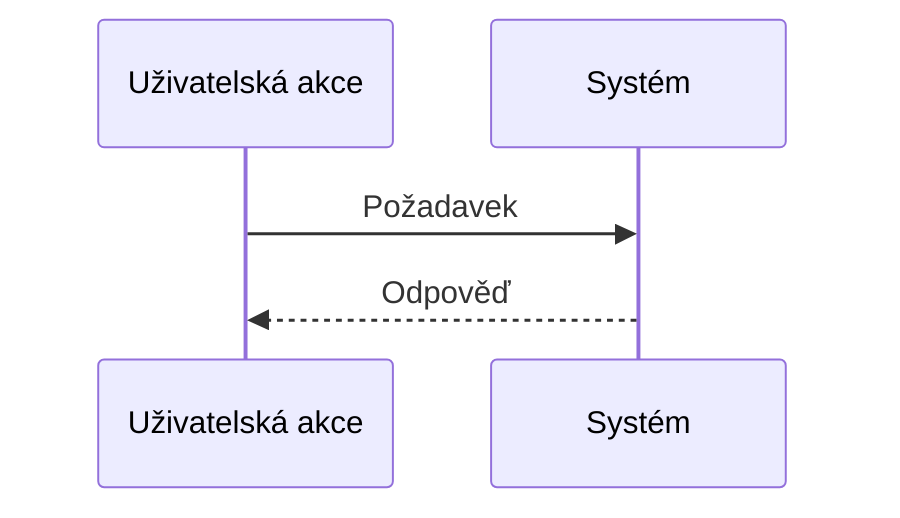
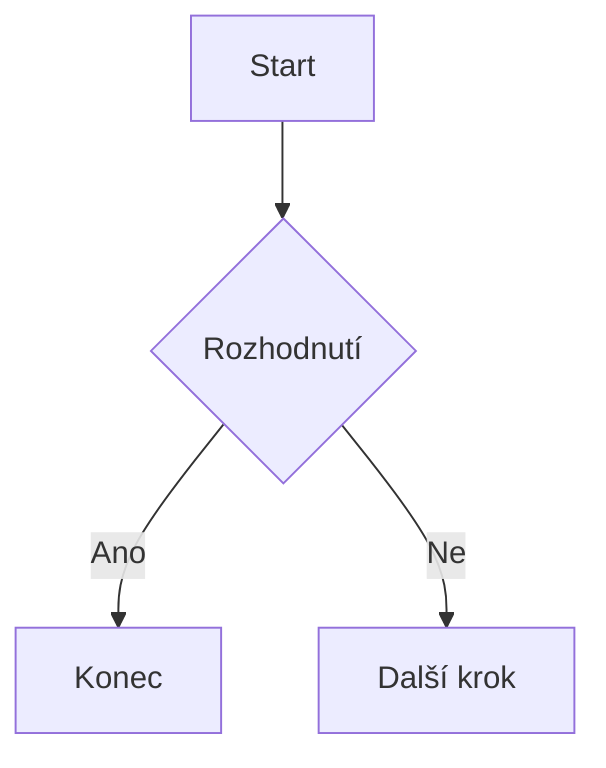
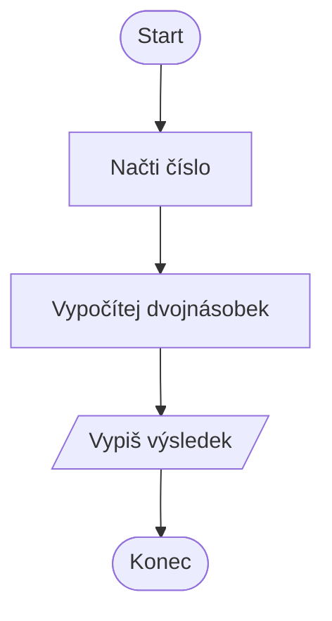
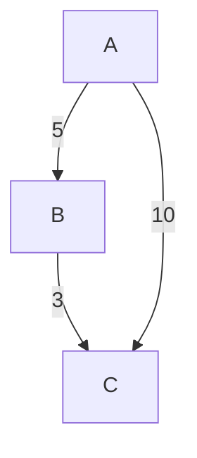

```mermaid
sequenceDiagram
  participant U as Uživatelská akce
  participant S as Systém
  U->>S: Požadavek
  S-->>U: Odpověď
```

```mermaid
flowchart TD
  A[Start] --> B{Rozhodnutí}
  B -->|Ano| C[Konec]
  B -->|Ne| D[Další krok]
```

```mermaid
      flowchart TD
      A([Start]) --> B[Načti číslo]
      B --> C[Vypočítej dvojnásobek]
      C --> D[/Vypiš výsledek/]
      D --> E([Konec])
```

```mermaid
graph TD
  A-- 5 -->B
  B-- 3 -->C
  A-- 10 -->C
```
