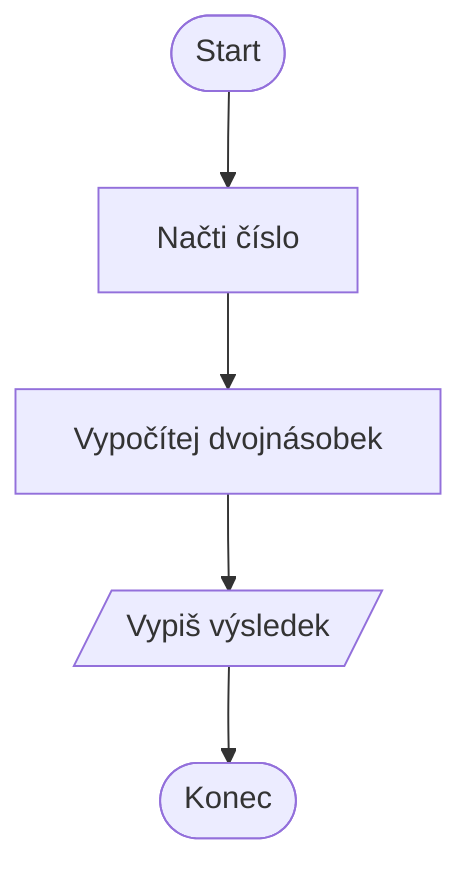
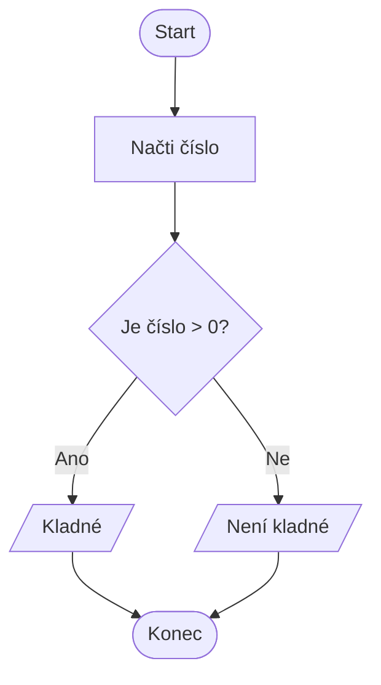

- **flowchart** — typ diagramu
- **TD** — směr shora dolů (Top → Down)  
  Další možnosti: LR (zleva doprava), BT (zdola nahoru)

---

## 🔷 Základní tvary (pro výuku nejdůležitější)

Tyto tvary stačí na většinu školních algoritmů.

| Tvar               | Syntaxe                   | Použití                   |
| ------------------ | ------------------------- | ------------------------- |
| **Start / Stop**   | `A([Start])`              | Začátek a konec programu  |
| **Proces**         | `A[Udělám něco]`          | Příkaz, krok programu     |
| **Vstup / Výstup** | `A[/Načti číslo/]`        | Čtení nebo výpis          |
| **Rozhodnutí**     | `A{Je podmínka splněna?}` | IF, větvení               |
| **Konektor**       | `A((K))`                  | Spojovací bod (volitelné) |

---

## 🔀 Spojování bloků

Nejčastější typy spojení:

- `A --> B` — běžná šipka
- `A -->|ano| B` — šipka s popiskem
- `A -.-> B` — tečkovaná šipka (méně používané)

---

## 🧠 Typické školní konstrukce

### 1. **Sekvence (kroky za sebou)**

````markdown

````

### 2. **Podmínka (IF)**

````markdown

````

### 3. **Opakování (WHILE)**

`````markdown
````mermaid
flowchart TD
  A([Start]) --> B[i = 1]
  B --> C{Je i ≤ 5?}
  C -->|Ano| D[/Vypiš i/]
  D --> E[i = i + 1]
  E --> C
  C -->|Ne| F([Konec])


### 4. **Jednoduchý algoritmus – součet dvou čísel**
```markdown
```mermaid
flowchart TD
  A([Start]) --> B[/Načti A/]
  B --> C[/Načti B/]
  C --> D[Součet = A + B]
  D --> E[/Vypiš Součet/]
  E --> F([Konec])
````
`````

---

## 🎨 Jednoduché zvýraznění (volitelné)

Pro lepší přehlednost můžeš zvýraznit důležité bloky:

```markdown
classDef input fill:#D6EAF8,stroke:#1B4F72;
classDef output fill:#D5F5E3,stroke:#1D8348;
class B,C input;
class D output;
```
